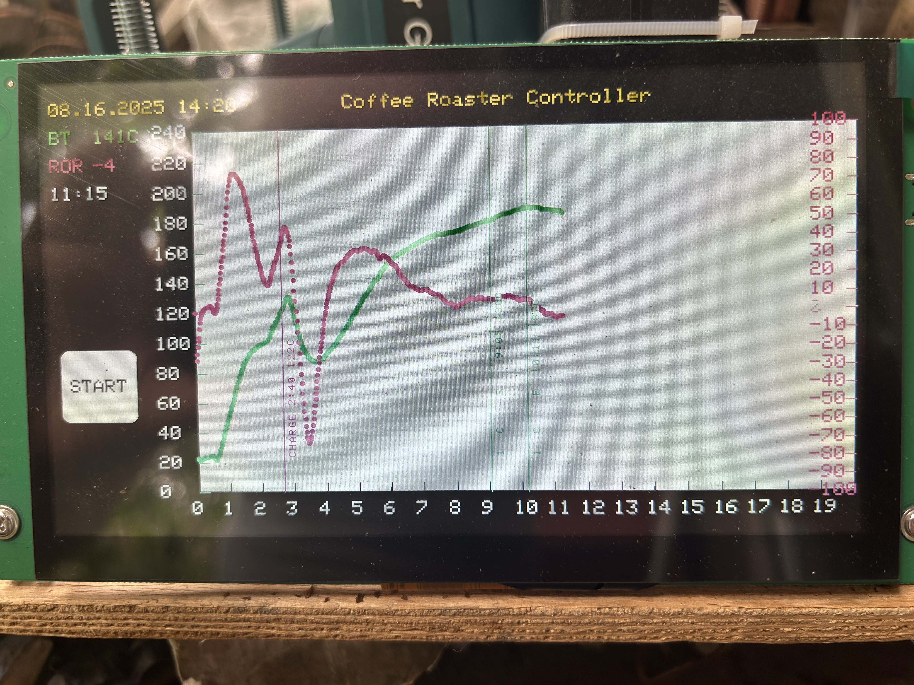

# Coffee Roaster Controller 

This Coffee Roaster Controller project is based on Panlee ZX7D00CE01S 7-inch display module with ESP32S3 processor onboard. It logs the coffee bean temperature measured by K-type thermocouple during roasting, captures the data using MAX31850 and displays the temperature and ROR graphs on the screen. Time and temperature values are stored in the internal flash memory and a .csv file in Artisan format can be downloaded by connecting to the built-in web server of the roaster.

Roaster video: https://youtu.be/a6N3_clXMxE

## Project Photos

### Hardware Setup


### Display Interface


### Roasting in Progress


*Note: Add your actual photos to the `images/` folder and update the filenames above.*

## File Structure

### Header Files (.h)
- **`config.h`** - All constants, defines, and configuration values
- **`data_structures.h`** - Data structures, enums, and external variable declarations
- **`temperature.h`** - Function declarations for temperature reading and ROR calculation
- **`graphics.h`** - Function declarations for graphics and touch screen functions
- **`webserver.h`** - Function declarations for web server and file operations

### Implementation Files (.cpp)
- **`temperature.cpp`** - Temperature sensor (MAX31850) functions and ROR calculations
- **`graphics.cpp`** - Display, touch, buttons, and UI functions
- **`webserver.cpp`** - WiFi, web server, and file saving functions
- **`globals.cpp`** - Global variable definitions

### Main Arduino File
- **`Coffee_Roaster_Controller.ino`** - Main Arduino file with setup() and loop() functions

## Module Organization

### 1. Configuration (`config.h`)
- WiFi credentials
- Display dimensions and colors
- Button and graph configurations
- Hardware pin definitions
- Temperature and ROR calculation parameters

### 2. Data Structures (`data_structures.h`)
- TouchPoint, RoastData, TouchButton structures
- RoastStage enumeration
- External declarations for global variables

### 3. Temperature Module (`temperature.h` + `temperature.cpp`)
- MAX31850 temperature sensor initialization and reading
- Temperature averaging functions
- ROR (Rate of Rise) calculation using Artisan-style algorithm
- Temperature calibration and offset handling

### 4. Graphics Module (`graphics.h` + `graphics.cpp`)
- Display initialization and backlight control
- Touch screen (GT911) functions
- Button handling and UI drawing
- Graph rendering (axes, data points, crack lines, charge line)
- AW9523 IO expander functions
- Custom font for vertical text

### 5. Web Server Module (`webserver.h` + `webserver.cpp`)
- WiFi connection and NTP time sync
- Web server setup and endpoints
- SPIFFS file system operations
- Roast profile saving in Artisan CSV format

### 6. Global Variables (`globals.cpp`)
- All global variable definitions
- Button objects
- Data arrays and state variables

## Benefits of This Structure

1. **Modularity**: Each functional area is separated into its own files
2. **Maintainability**: Easier to find and modify specific functionality
3. **Readability**: Smaller, focused files are easier to understand
4. **Reusability**: Functions can be easily reused or moved to other projects
5. **Debugging**: Easier to isolate issues to specific modules

## Setup Instructions

### 1. WiFi Configuration
Before uploading to your device, you need to configure your WiFi credentials:

1. **Copy the template file:**
   ```bash
   cp config_template.h secrets.h
   ```

2. **Edit `secrets.h` with your actual credentials:**
   ```cpp
   #define WIFI_SSID "Your_Actual_WiFi_Name"
   #define WIFI_PASSWORD "Your_Actual_WiFi_Password"
   #define TIME_ZONE 4  // Adjust for your timezone
   #define TEMP_OFFSET 0 // Temperature calibration offset
   ```

3. **Never commit `secrets.h` to Git** - it's already in `.gitignore`

### 2. Compilation
To use the modular structure:

1. Make sure all the `.h`, `.cpp`, and `.ino` files are in the same directory
2. Open `Coffee_Roaster_Controller_Multifile.ino` in the Arduino IDE
3. The IDE will automatically compile all the included files
